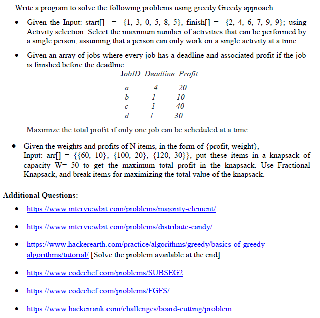

# Algorithm-1

1. Pair start[] and finish[] as (start[i], finish[i]).
2. Sort the activities by finish[].
3. Initialize a variable `lastFinish = 0` to track the finish time of the last selected activity.
4. For each activity in sorted order:
    a. If start time >= lastFinish:
        i. Select the activity.
        ii. Update lastFinish to the current activity's finish time.
5. Count and print the selected activities.

# Algorithm-2
